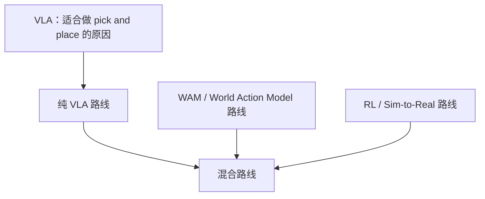

# VLA Notes

原文内容按主题拆分为 5 份笔记，正文只做 Markdown 排版与可视化组织，不改原意。

- [pick_and_place.md](./pick_and_place.md)
- [pure_vla.md](./pure_vla.md)
- [wam.md](./wam.md)
- [rl_sim2real.md](./rl_sim2real.md)
- [hybrid_route.md](./hybrid_route.md)
