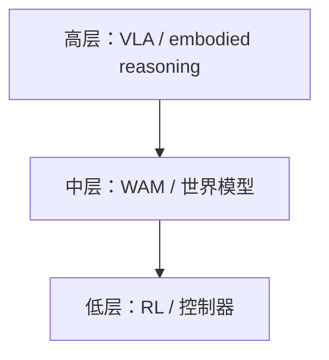
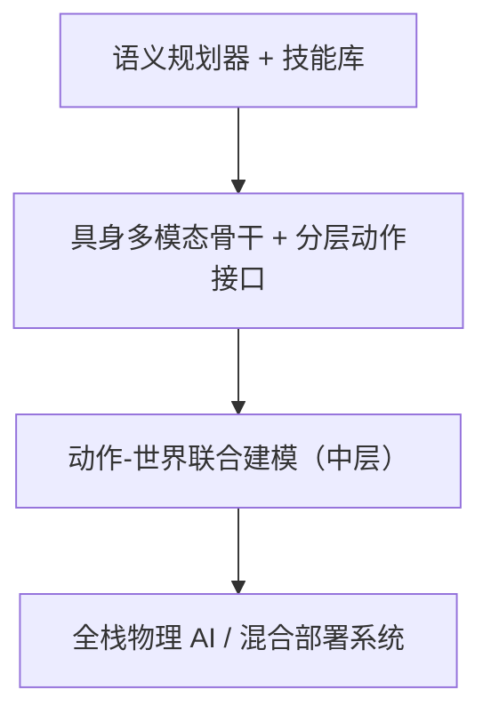

# 混合路线

## 原文

混合路线  
 高层用 VLA / embodied reasoning 理解任务，  
 中层用 WAM / 世界模型 预测未来和做规划，  
 低层用 RL / 控制器 保证动作稳定执行。  
 这条路线最像现在真正能落地、也最可能走向通用机器人的方向。

## 1. 技术分流派

我建议把混合路线拆成 4 个技术流派来看，这样时间线会很清楚。

### 第一类：语义规划器 + 技能库

核心思想是：先别让大模型直接出关节动作，而是先让它选下一步该做什么技能，再由底层 skill policy / value function 去执行。SayCan 和 Inner Monologue 是这类的起点。它们解决的是：LLM 会说，但不一定会做；机器人需要可行且有用的下一步。

### 第二类：具身多模态骨干 + 分层动作接口

核心思想是：把视觉、语言、状态等信息统一进一个 embodied backbone，但不迷信一步到位直接输出所有低层控制，而是逐步引入层级结构。PaLM-E、RT-H、Hi Robot 属于这类。它们解决的是：高层推理、复杂指令、用户反馈和低层动作之间怎么接起来。

### 第三类：动作-世界联合建模（中层）

核心思想是：中间层不能只翻译任务，还要会想象做了动作后世界怎么变。UWM、WorldVLA、Cosmos Policy、DreamZero 属于这类。它们解决的是：纯 VLA 语义强，但对物理演化、未来状态和长时程成功率的建模不够。

### 第四类：全栈物理 AI / 混合部署系统

核心思想是：把高层 VLA、世界模型、低层 RL、导航、SLAM、安全控制都拼成一套系统，而不是赌单个大模型。Gemini Robotics + Robotics-ER、GR00T N1 / N1.6 workflow 是这类最典型的代表。它们解决的是：真正落地时，光有一个强 policy 还不够。

## 2. 按时间线梳理

### 2022：SayCan

要解决的问题：语言模型很会生成看起来合理的步骤，但这些步骤未必对当前机器人可执行。  
核心 insight：把语言模型的有用性与底层技能 value function 的可行性结合起来，选出既合理又能做的技能。  
它的重要性：这是混合路线很早的雏形：高层负责想，低层技能库负责做。 它还不是今天的 VLA，但已经把高层语义规划 + 低层执行这个架构定出来了。

### 2022：Inner Monologue

要解决的问题：光选一次技能不够，机器人在执行过程中还会遇到新反馈、新错误、新约束。  
核心 insight：把环境反馈、场景描述、人类纠正等信息不断写回语言模型，让高层在执行中持续重规划。  
它的重要性：它把混合路线从先规划后执行推进到边执行边重规划，这其实就是今天很多 agentic robot system 的祖型。

### 2023：PaLM-E

要解决的问题：如果高层只是一个外挂 planner，它和感知、状态、任务理解之间的耦合仍然太松。  
核心 insight：把视觉、连续状态估计、文本等都塞进同一个 embodied multimodal language model 里，形成统一的具身骨干，并且让机器人任务、VQA、captioning 等多任务联合训练产生正迁移。  
它的重要性：PaLM-E 不是完整混合系统，但它奠定了一个关键前提：高层不只是一个纯文本 planner，而可以是一个真正的 embodied backbone。

### 2024：RT-H

要解决的问题：即便有 embodied backbone，直接从高层任务到低层动作仍然太平，不够分层。  
核心 insight：引入language motions这个中间层，先预测高层语言动作，再条件化生成真实动作，形成语言动作层级结构。  
它的重要性：RT-H 很像一个非常明确的信号：VLA 开始认真引入 hierarchy，而不是只做 flat end-to-end。

### 2025：Hi Robot

要解决的问题：真实世界开放指令太复杂，用户还会在执行中插话、纠正、加约束。  
核心 insight：显式采用 hierarchical VLM/VLA 结构，先推理复杂指令和反馈，再由低层动作模块执行；并在单臂、双臂、双臂移动平台上验证。  
它的重要性：Hi Robot 非常接近你说的混合路线的工程样子了，因为它不是在追求一个统一大脑一步到位，而是在追求高层理解中间任务决策低层动作执行的可落地组合。

### 2025：Gemini Robotics + Gemini Robotics-ER

要解决的问题：纯 VLA 直接控机器人很强，但复杂推理、空间理解、代码生成、与现有控制器的衔接还需要更清晰的角色分工。  
核心 insight：Google 明确把 Gemini Robotics 做成直接控机器人的 VLA，把 Gemini Robotics-ER 做成 embodied reasoning 模型；ER 侧强调空间理解、规划、代码生成，并且官方明确说它可以连接现有低层控制器和安全关键控制器。  
它的重要性：这基本是大厂第一次把高层 reasoning和低层 control公开地拆成两个兄弟模块，而不是只说一个超级端到端模型。

### 2025：Gemini Robotics On-Device

要解决的问题：混合路线如果不能本地跑、不能快速适配，落地仍然很难。  
核心 insight：推出 on-device 版本，强调 general-purpose dexterity 和 fast task adaptation，把高层能力进一步往部署端压。  
它的重要性：它说明混合路线开始关心一个很现实的问题：不是只会想，还得能在机器人本体上高效运行。

### 2025：UWM

要解决的问题：高层与中层之间仍然是断的；视频数据很多，但没动作标签，难直接服务 policy learning。  
核心 insight：把 video diffusion 和 action diffusion 耦合进一个统一 transformer，用独立 diffusion timestep 控制每个模态，从而让一个模型既能当 policy，又能当 forward dynamics、inverse dynamics、video generator。  
它的重要性：UWM 是混合路线里中层开始真正成型的标志。它把世界模型从旁路模块，推进成了决策耦合模块。

### 2025：WorldVLA

要解决的问题：如果动作模型和世界模型分开练，它们很容易各干各的。  
核心 insight：把 VLA 和 world model 放进同一个自回归框架，世界模型预测未来图像，动作模型预测后续动作，两者相互增强。  
它的重要性：它代表混合路线的另一种趋势：不是模块越来越松，而是高层 action model 和中层 world model 越来越强耦合。

### 2025：GR00T N1

要解决的问题：面向 humanoid 或复杂 embodiment 时，单一 VLA 既要理解，又要实时出电机动作，很难兼顾。  
核心 insight：采用 dual-system architecture：System 2 做 vision-language understanding，System 1 用 diffusion transformer 生成实时 motor actions，二者联合训练。  
它的重要性：GR00T N1 说明thinking fast and slow不只是说法，而是在机器人 VLA 里真的被做成了系统结构。

### 2026：Cosmos Policy

要解决的问题：很多世界模型路线太复杂，要多阶段训练，还要额外动作头。  
核心 insight：直接把动作、未来状态图像、value 都编码成 latent frames，单阶段 post-training 就把大视频模型改成有效 policy，还能做 test-time planning。  
它的重要性：Cosmos Policy 很像你说的中层的一个极强版本：它不是只预测未来，而是把未来预测、动作生成、价值评估、规划揉到同一个视频 backbone 里。

### 2026：DreamZero

要解决的问题：纯 VLA 在语义泛化上强，但对新物理运动和新环境的泛化不够；而且大家会质疑 world model/WAM 是否实时。  
核心 insight：提出 WAM，联合预测 future world states 和 actions，用视频作为物理演化的稠密表示，并把 14B 视频扩散模型优化到 7Hz 闭环。  
它的重要性：DreamZero 把中层进一步往几乎就是 policy 本体推了一大步，也强化了混合路线里世界模型不是可选件这个趋势。

### 2026：GR00T N1.6 workflow

要解决的问题：真正部署时，机器人不只是 manipulation，还要导航、定位、场景理解、全身协调。  
核心 insight：NVIDIA 公开把 whole-body RL、synthetic-data navigation、SLAM、VLA、world models（如 Cosmos Reason）串成一个 sim-to-real workflow，并明确说 N1.6 用世界模型把高层指令分解成 stepwise action plans。  
它的重要性：这基本就是混合路线的官方工业版样子：高层 VLA/ER，中层 world model/planning，低层 RL/control，再外加导航与安全模块。

## 3. 这条路线真正的技术主线是什么

如果把上面压缩成一句技术演化逻辑，就是：  
第一步，先把高层语义和低层技能分开，解决会说不会做的问题；  
第二步，再把 embodied backbone 做强，让高层不只是 planner，而是能看、能理解、能推理；  
第三步，把世界模型拉进中层，解决做了动作后世界会怎样的问题；  
第四步，把低层 RL / control、导航、SLAM、安全控制真正接进来，做成可部署系统。这个趋势已经在 Google 的 Gemini Robotics/ER 和 NVIDIA 的 GR00T N1.6 workflow 里公开体现出来了。

我自己的判断也很直接：  
这条路线之所以最有希望，不是因为它最优雅，而是因为它最符合机器人现实。  
 机器人不是纯软件 agent。你必须同时处理语言、视觉、空间、动力学、时延、导航、接触、安全和硬件约束。单一路线很容易在某一层很强，但在别层掉链子；而混合路线刚好承认了这个现实：不同层级的问题，本来就该由不同模块主导。 这也是为什么高层越来越像 VLA / embodied reasoning，中层越来越像 world model / WAM，低层越来越像 RL / safety-critical controller。

## 5. References list

下面这个 list 我按你后续阅读最顺手的顺序列，和上面的时间线一一对应。

高层规划 / 分层起点  
1. SayCan / Do As I Can, Not As I Say  
2. Inner Monologue  
3. PaLM-E  
4. RT-H  
5. Hi Robot

高层 embodied reasoning / 具身系统化  
6. Gemini Robotics + Gemini Robotics-ER  
7. Gemini Robotics On-Device

中层世界模型 / 动作世界模型  
8. Unified World Models (UWM)  
9. WorldVLA  
10. Cosmos Policy  
11. DreamZero / World Action Models are Zero-shot Policies

全栈混合部署  
12. GR00T N1  
13. GR00T N1.6 sim-to-real workflow

低层 RL / 控制作为前提能力  
14. RMA  
15. Real-World Humanoid Locomotion with RL  
16. Learning Sim-to-Real Humanoid Locomotion in 15 Minutes
