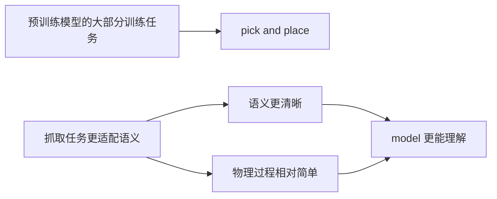

# VLA：适合做 pick and place 的原因

## 原文

1、预训练的模型大部分的训练任务都是pick and place

2、抓取任务更适配语义：比如把红色方块放到盒子里面，这样的语义更加清晰，物理过程相对简单，model更能理解(相比于更复杂的精细任务) （by 直觉）

## References

1. https://droid-dataset.github.io/visualizer/
2. https://arxiv.org/pdf/2602.15922
3. https://arxiv.org/html/2406.09246v1
