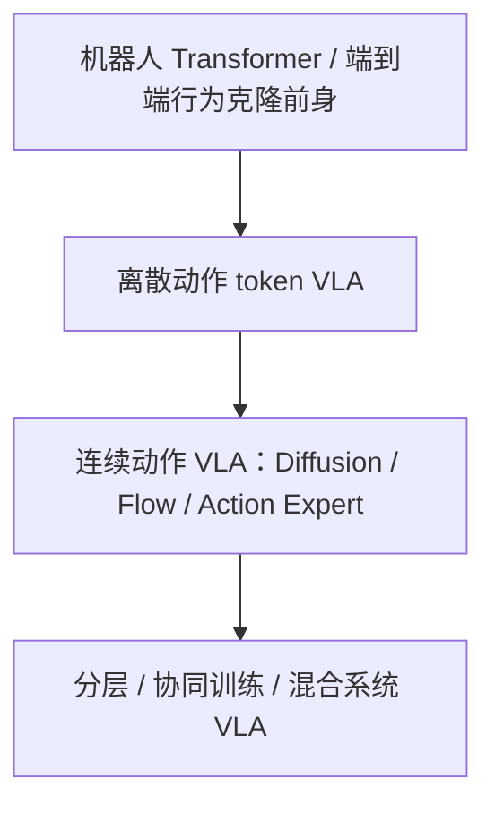
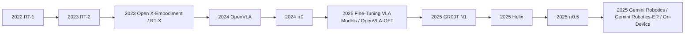

# 纯 VLA 路线

## 原文

1. 纯 VLA 路线  
用视觉语言模型做底座，输入图像+语言，直接输出动作。  
强项是语义理解、语言跟随、开放词汇泛化；短板是物理动态理解、长时程接触操作、对新环境运动规律的泛化。OpenVLA、Gemini Robotics 都属于这条大线。

VLA 的发展主线，不是模型越来越大这么简单，而是三次转向：  
从机器人数据规模化  从 web 语义迁移到动作  从离散动作 token 走向连续高频控制与分层/混合系统。这个判断和近两篇综述对 VLA 演化的总结是吻合的。(arXiv)

---

## 一、技术分流派

我建议把 VLA 先分成 4 条主流技术流派。这样后面的时间线就不会乱。

### A. 机器人 Transformer / 端到端行为克隆前身

这类工作还不一定都显式叫 VLA，但它们奠定了 VLA 的接口：图像 + 指令 + 动作序列，用统一 Transformer 做策略学习。代表起点是 RT-1。它解决的是机器人数据能不能像 NLP/CV 一样靠规模和 Transformer 吃起来。(arXiv)

### B. 离散动作 token VLA

核心做法是：把动作也离散化成 token，直接塞进 VLM/LLM 的序列建模框架里。代表是 RT-2，以及某种意义上的早期 OpenVLA 范式。它解决的是怎么把 web-scale VLM 的语义能力直接迁到机器人控制。(arXiv)

### C. 连续动作 VLA：Diffusion / Flow / Action Expert

核心做法是：VLM 保留语义 backbone，但动作不再硬离散成文本 token，而是用 diffusion、flow matching、连续 action head 来输出更细腻、更高频的控制。代表是 π0、GR00T N1、Helix。它们解决的是离散 token 不适合高维连续控制的瓶颈。(Physical Intelligence)

Diffusion（VLA 版）：GR00T N1  https://arxiv.org/abs/2503.14734  
Flow Matching：π0  https://arxiv.org/abs/2410.24164  
连续 action head：Fine-Tuning Vision-Language-Action Models  https://arxiv.org/abs/2502.19645

### D. 分层 / 协同训练 / 混合系统 VLA

RT-1 属于可扩展机器人 Transformer 前身，重点是先把图像、指令、动作的统一策略接口和大规模机器人数据训练跑通；RT-2 属于离散动作 token 的 VLA，重点是把 web-scale VLM 的语义能力迁到机器人动作上；OpenVLA 属于开放生态/开源可复现 VLA，重点是把这条路线开放给社区研究和微调；π0、GR00T N1、Helix 属于连续动作 VLA，重点是解决离散 action token 不适合高维连续控制的问题；π0.5、Gemini Robotics / Gemini Robotics-ER 属于分层/混合系统 VLA，重点是让 VLA 负责高层语义与任务理解，把低层控制、具身推理或部署适配进一步拆分出去，解决纯 VLA 在物理建模和工程落地上不够稳的问题。

---

## 二、按时间线梳理

### 2022：RT-1

代表作：RT-1: Robotics Transformer for Real-World Control at Scale。(arXiv)

Comment:

推动通用策略的重要节点，RL没办法解决通用问题我觉得是因为RL的目标设定太单一，每个用RL训练好的agent只能在具体的某个任务上去做，同一个任务的泛化性当然是有的，但是纯RL在同一套策略很难做到跨不同结构的任务做到泛化，因此很难做到通用。  
NLP 和 CV 已经证明大模型 + 大规模多样数据能带来强泛化，那么机器人能不能也走这条路先让一个模型真正吃下大量真实机器人数据，再在真实控制里既泛化、又跑得动。 作者的回答是：可以，但前提不是单靠 Transformer或者单靠 BC就行，而是要同时解决三件事：第一，数据问题，机器人数据天然昂贵又稀缺，所以他们用 13 台机器人在 17 个月里收集了约 13 万条真实轨迹、覆盖 700 多个任务，并且专门证明了数据多样性比单纯堆数据量更关键；第二，模型吸收能力问题，RT-1 不是普通 BC，而是一个多任务、语言条件、短时历史、离散动作的 BC policy，它把语言指令 + 6 帧图像历史先变成任务条件下的视觉表示，再压缩成少量 token，交给 Transformer 做时序决策，因此它的泛化本质上来自大规模多任务数据 + 语言条件结构 + 合适表示设计的共同作用，而不是因为 BC 突然自己会泛化或者因为 Transformer 天生万能；第三，实时控制问题，真实机器人不能像离线模型那样只追求大，必须还要快，所以 EfficientNet、FiLM、TokenLearner、动作离散化、mask 设计这些模块都不是为了炫技，而是在容量、泛化、实时性之间做折中：前端用 CNN 视觉编码器提特征，语言通过 FiLM 尽早注入，TokenLearner 压缩 token 数量，Transformer 负责时序建模，最后把动作预测成离散 token再还原成机器人动作，从而让模型在真实系统里达到约 3Hz 的闭环控制。最终，这篇文章真正证明的不是机器人已经会开放世界泛化，而是机器人也可以开始拥有类似大模型的吃数据能力：它能对已见概念的新组合产生不错的泛化，但还不能真正泛化到完全没见过的新技能，而且作为 imitation learning，它也受限于示教数据质量，理论上很难稳定超过示教者上限。

---

### 2023：RT-2

代表作：RT-2: Vision-Language-Action Models Transfer Web Knowledge to Robotic Control。(arXiv)

它要解决的问题：  
RT-1 能吃大机器人数据，但它不具备 web-scale 语义常识。RT-2 直接瞄准这个缺口：机器人能不能继承 VLM 在互联网图文上学到的知识与推理能力。(arXiv)

核心 insight：  
把动作表示成文本 token，和自然语言放进同一个序列建模框架里，一起 co-fine-tune。这样 VLM 里已有的语义能力就能直接迁到动作输出上。RT-2 论文里最著名的点就是：它能更好处理新物体、带图标/数字的指令、甚至做一点 rudimentary reasoning。

它的重要性：  
RT-2 基本就是VLA这个词真正出圈的起点。它让大家意识到：机器人控制不一定要从零学，可以站在 VLM 的肩膀上。

局限也很清楚：  
动作离散成 token 很优雅，但这天然更适合低频 chunk 和语义驱动任务，不太天然适合高维、连续、高速控制。这个问题后来几乎定义了 20242025 的后续工作。(arXiv)

我的判断：  
RT-2 解决的是语义泛化从哪来，但没真正解决连续控制怎么优雅地做。

---

### 2023：Open X-Embodiment / RT-X

代表作：Open X-Embodiment: Robotic Learning Datasets and RT-X Models。(arXiv)

它要解决的问题：  
单机器人、单实验室的数据太窄。VLA 如果真想 generalize，必须面对跨实验室、跨机器人本体、跨控制接口的数据混杂问题。(arXiv)

核心 insight：  
把来自多家机构的真实机器人轨迹统一成一个大混合数据集，训练跨本体的 RT-1-X / RT-2-X。重点不是模型花活，而是数据层面的 open embodiment scaling。

它的重要性：  
这一步把generalist robot policy从单机 demo 推到了社区级数据工程。之后 OpenVLA 能成立，和 Open X 的开放数据基础直接相关。

我的判断：  
Open X 的地位非常高。它不是最 flashy 的模型，但它回答了一个根本问题：VLA 靠什么长大。

---

### 2024：OpenVLA

代表作：OpenVLA: An Open-Source Vision-Language-Action Model。(arXiv)

它要解决的问题：  
RT-2 这条路很强，但很多强模型是闭源的，社区难以复现、难以微调、难以比较。OpenVLA 的问题意识非常明确：要把 VLA 从少数实验室能玩变成社区可研究、可适配的东西。

核心 insight：  
用公开机器人数据训练一个 7B 开源 VLA，并把训练和微调路径开放出来。它的意义不只是模型本身，而是把 VLA 变成了一个可操作对象。

它的重要性：  
OpenVLA 让很多后续工作开始真正研究：
- VLA 怎么适配新任务
- 动作表示怎么选
- fine-tuning 怎么做更快更稳

这些问题在闭源时代很难系统研究。

我的判断：  
OpenVLA 不是范式革命型工作，但它是生态拐点。  
没有它，很多后续VLA 工程学不会这么快起来。

---

### 2024：π0

代表作：π0: A Vision-Language-Action Flow Model for General Robot Control。(Physical Intelligence)

它要解决的问题：  
RT-2 / OpenVLA 这类离散动作 token 路线，在高维连续控制上不够自然。π0 直接对准这个瓶颈：如何把 VLM 语义 backbone 和连续动作生成更自然地结合起来。

核心 insight：  
引入 flow matching 的 action expert，让 VLM 不再直接吐离散动作 token，而是通过连续流模型输出动作，并声称能实现高频控制。官方材料里明确提到 dexterous tasks 上可达较高控制频率。

它的重要性：  
π0 标志着 VLA 从语义对动作的离散映射走向语义 backbone + 专门连续控制头。  
这一步之后，VLA 不再只是会做 pick-and-place 类 demo，而开始认真碰灵巧操作和高频控制。

我的判断：  
π0 是一个非常关键的分水岭。它说明大家已经默认：动作不能一直当文本。

---

### 2025：Fine-Tuning VLA Models / OpenVLA-OFT

代表作：Fine-Tuning Vision-Language-Action Models。(arXiv)

它要解决的问题：  
VLA 预训练再强，落到新机器人、新任务时还是得调。问题变成：怎样微调才能既快、又不掉成功率、还能跑得更实时。(arXiv)

核心 insight：  
系统研究 action decoding、action representation、loss 等设计，证明适配 recipe 会显著影响效果；OpenVLA-OFT 在 LIBERO 和 ALOHA 上都给出很强结果。

它的重要性：  
这类工作代表 VLA 研究从架构狂飙进入VLA 工程学。也就是开始认真回答：  
预训练后怎么落地，怎么让动作生成又快又稳。

我的判断：  
这类工作不一定最吸引眼球，但它很关键，因为现实里多数团队不是从零训大模型，而是拿 base VLA 来调。

---

### 2025：GR00T N1

代表作：GR00T N1: An Open Foundation Model for Generalist Humanoid Robots。(arXiv)

它要解决的问题：  
过去很多 VLA 偏桌面机械臂，humanoid 的 whole-body control、上半身协调、跨身体技能迁移更难。GR00T N1 直接瞄准：面向 humanoid 的 generalist VLA 要怎么搭。

核心 insight：  
它采用 dual-system architecture：  
System 2 负责 vision-language understanding，  
System 1 用 diffusion transformer 生成实时 motor actions。  
这个设计已经很明确地体现出语义理解和快速运动生成分层。

它的重要性：  
GR00T 把 VLA 从单臂桌面操作进一步拉向 humanoid foundation model，而且强调多源数据：人类视频、真实机器人轨迹、仿真和合成数据。(NVIDIA)

我的判断：  
GR00T 代表的不是单纯更大 VLA，而是 VLA 开始系统化地和 humanoid、仿真、合成数据、whole-body control 结合。

---

### 2025：Helix

代表作：Figure Helix。(FigureAI)

它要解决的问题：  
很多 VLA 做到的是低频动作 chunk，但 humanoid 真正要干活，需要更高频、更连续、更大自由度的控制。Helix 的目标是：让 VLA 真正驱动 humanoid 上半身高频连续动作。(FigureAI)

核心 insight：  
官方强调它能输出整个 humanoid 上半身的高率连续控制，包括手、腕、头、躯干和单指。这个方向本身就是对离散 token VLA 不够的直接回答。(FigureAI)

它的重要性：  
Helix 说明工业界已经不满足于会做语义对齐的抓取 demo，而是把 VLA 往真正的复杂身体控制上推。(FigureAI)

我的判断：  
Helix 很像一个信号：VLA 必须吃掉更多连续控制，否则上不了 humanoid 主舞台。

---

### 2025：π0.5

代表作：π0.5。(Physical Intelligence)

它要解决的问题：  
即便 π0 解决了连续控制，VLA 还是容易受限于机器人动作数据本身。π0.5 直接对准这个问题：能不能把机器人数据、语言数据、视觉任务、高层语义监督等异构知识一起 co-train 进 VLA。(Physical Intelligence)

核心 insight：  
通过 heterogeneous co-training，让 VLA 不只会怎么动，还会在更开放世界里理解任务上下文、任务结构和跨机器人知识。(Physical Intelligence)

它的重要性：  
这一步表明 VLA 的训练不再局限于机器人示教轨迹，而是正式进入多源知识协同训练阶段。(Physical Intelligence)

我的判断：  
π0.5 很重要，因为它代表 VLA 不只是动作模型，而是在变成一个 physical agent backbone。

---

### 2025：Gemini Robotics / Gemini Robotics-ER / On-Device

代表作：Gemini Robotics、Gemini Robotics-ER、Gemini Robotics On-Device。(blog.google)

它要解决的问题：  
纯 end-to-end VLA 的问题越来越明显：
- 高层推理和低层控制缠在一起
- 实时本地部署难
- 开放环境 reasoning 不够强

Google 的回答是：把 embodied reasoning 和动作执行更明确地拆开，并推进 on-device 版本。(Google DeepMind)

核心 insight：  
Gemini Robotics 是动作模型；Gemini Robotics-ER 更偏 embodied reasoning，可与现有控制器结合；On-Device 则解决本地部署和快速适配。这说明 Google 也在从单一 VLA走向VLA + embodied reasoning + deployment stack。(Google DeepMind)

它的重要性：  
这代表 VLA 的下一阶段不只是拼 benchmark，而是拼：  
推理、部署、分层推理、和现有机器人系统的整合。(Google DeepMind)

我的判断：  
Gemini 这条线非常说明问题：最强的公司也不再把 VLA 当成一个孤立 policy，而是当成整个具身系统里的核心模块。
