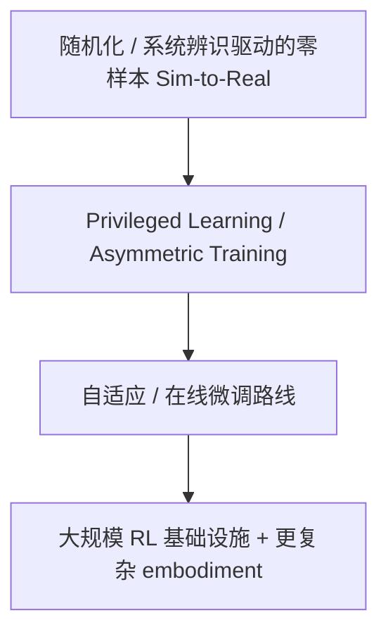

# RL / Sim-to-Real 路线

## 原文

RL / Sim-to-Real 路线  
 主要解决低层身体能力，比如走路、平衡、抓取稳定性、全身协调。  
 强项是真实控制能力强；短板是语义弱、任务泛化弱、很难单独走到通用机器人。所以现在更像是通用机器人系统里的低层执行器。这一点也和当前 GR00T 一类系统的工程思路一致。

这条路线的核心目标一直很稳定：在仿真里学低层身体技能，再把它可靠地搬到真实机器人上。  
 它最擅长解决的是 locomotion、balance、recovery、contact-rich control、whole-body coordination 这类身体层问题；它的发展主线也很清楚：  
从随机化过桥  用 privileged information 和 adaptation 稳住  靠 massively parallel RL 把训练速度拉上去  把控制对象从四足扩到视觉、双臂、轮腿、人形和灵巧手。

## 一、从技术层面分流派

我建议把这条路线分成 4 个技术流派。

### 1）随机化 / 系统辨识驱动的零样本 Sim-to-Real

核心思想是：既然仿真不可能和现实完全一样，那就把仿真训练成什么误差都见过一点。  
 最早的代表是 Dynamics Randomization。后续很多腿足和手部系统都沿着这条路走。它解决的是最原始的问题：policy 为什么一出仿真就死。

### 2）Privileged Learning / Asymmetric Training

核心思想是：训练时利用仿真里的全状态优势，部署时只给真实可得观测。  
 这类方法不是直接缩小 reality gap，而是让学习过程更稳、更高效。代表起点是 Asymmetric Actor-Critic；后来很多腿足 RL 都把 privileged teacher / student、state critic / observation actor 变成默认套路。

### 3）自适应 / 在线微调路线

核心思想是：光靠训练时随机化不够，机器人到了现场还要继续适应。  
 这里又分两种典型方式：  
 一种是 test-time adaptation，代表是 RMA；  
 另一种是 real-world fine-tuning，代表是 Legged Robots that Keep on Learning。  
 这条线解决的是：仿真里没覆盖到的 terrain、payload、wear-and-tear、接触差异怎么办。

### 4）大规模 RL 基础设施 + 更复杂 embodiment

这条线的核心不是单个算法创新，而是把 RL 变成真正能服务复杂机器人身体的工业流程。  
 代表包括：  
massively parallel training（Rudin）、  
极高机动性 locomotion（Rapid Locomotion）、  
视觉 locomotion（MMDR）、  
loco-manipulation（DribbleBot）、  
humanoid locomotion，以及最近的 vision-based humanoid dexterous manipulation。  
 它们解决的是：如何把 RL 从四足走路扩到更高自由度、更强耦合、更依赖感知的系统。

---

## 二、按时间线梳理关键工作

下面我只选真正有里程碑意义的。

### 2017：Dynamics Randomization

代表作：Sim-to-Real Transfer of Robotic Control with Dynamics Randomization。  
它要解决的问题：sim2real gap 太大，仿真学到的控制器一到真实机器人就崩。  
insight：不是去拟合唯一正确的仿真参数，而是训练时随机化质量、摩擦、阻尼等动力学参数，让策略对一整个参数分布鲁棒。  
为什么重要：这是后面几乎所有 sim-to-real RL 配方的根方法之一。

### 2017：Asymmetric Actor-Critic

代表作：Asymmetric Actor Critic for Image-Based Robot Learning。  
它要解决的问题：真实机器人只能看到部分观测，但仿真里明明有全状态，不利用太浪费。  
insight：训练时让 critic 看全状态，actor 只看将来真实部署可用的观测；再配合 domain randomization 做 real transfer。  
为什么重要：它奠定了很多后续 sim-to-real RL 的训练范式：训练时作弊，部署时不作弊。

### 2018：OpenAI Dexterous Hand

代表作：Learning Dexterous In-Hand Manipulation。  
它要解决的问题：高自由度、多接触、多指协调的灵巧手，传统控制特别难。  
insight：大规模 RL + 大量物理与视觉随机化，可以在纯仿真中学出可落地到真实 Shadow Hand 的 dexterous manipulation。  
为什么重要：它把 sim-to-real RL 从机械臂推方块推进到了复杂多指控制。

### 2019：OpenAI Rubiks Cube

代表作：Solving Rubiks Cube with a Robot Hand。  
它要解决的问题：前一代随机化虽然有效，但复杂任务需要更系统的鲁棒性扩展。  
insight：提出 ADR（Automatic Domain Randomization），自动逐步扩大随机化分布，而不是手工设定固定范围。  
为什么重要：它把randomization 不是调参细节，而是训练课程的一部分这件事讲透了。

### 2019：ANYmal Locomotion

代表作：Learning Agile and Dynamic Motor Skills for Legged Robots。  
它要解决的问题：腿足机器人要跑得快、稳、还能起身恢复，传统 handcrafted controller 成本高。  
insight：直接在仿真里训练 neural policy，再转到真实 ANYmal，完成速度跟踪和跌倒恢复。  
为什么重要：这是 legged sim-to-real RL 真正出圈的起点之一。

### 2020：Dynamics Randomization Revisited

代表作：Dynamics Randomization Revisited: A Case Study for Quadrupedal Locomotion。  
它要解决的问题：行业里开始默认randomization 越多越好，但证据其实混乱。  
insight：在 quadruped locomotion 上系统做 ablation，指出并不是所有成功都来自大力 randomization，很多设计细节也同样关键。  
为什么重要：它让这个领域开始从迷信 randomization转向分析 sim2real 配方到底哪部分有效。

### 2021：MMDR 视觉四足

代表作：Vision-Guided Quadrupedal Locomotion in the Wild with Multi-Modal Delay Randomization。  
它要解决的问题：一旦加视觉，sim2real 不只是外观 gap，还有感知-控制链路时延。  
insight：训练时对 proprioception 和 vision 的延迟一起随机化，显式让策略学会抗 latency。  
为什么重要：它说明了一个关键事实：真实机器人上的 gap 不只在物理参数，也在系统延时和感知时序。

### 2021：RMA

代表作：RMA: Rapid Motor Adaptation for Legged Robots。  
它要解决的问题：地形、载荷、磨损、摩擦变化，训练时不可能全覆盖。  
insight：把控制拆成 base policy + adaptation module，用短时历史快速推断环境/身体隐变量，实现 test-time adaptation。  
为什么重要：这基本定义了后来一大类快速适应型腿足 RL路线。

### 2021/2022：训练速度革命

代表作 1：Learning to Walk in Minutes Using Massively Parallel Deep Reinforcement Learning。  
它要解决的问题：RL 好用，但训练太慢。  
insight：通过 massively parallel simulation、合适的 curriculum 和训练设置，把腿足 locomotion 训练压到分钟级。  
为什么重要：它让 sim-to-real RL 从能做一次很难的实验变成可以反复迭代。

代表作 2：A Walk in the Park: Learning to Walk in 20 Minutes With Model-Free Reinforcement Learning。  
它要解决的问题：如果连仿真都难配，能不能直接在真实世界学。  
insight：利用高效 off-policy RL 和 carefully tuned controller，在真实四足上用二十分钟左右学会 walking。  
为什么重要：它给出了一个相反方向的答案：不一定总是 sim-to-real，也可以 real-world RL with enough efficiency。

### 2021/2022：真实世界持续学习

代表作：Legged Robots that Keep on Learning: Fine-Tuning Locomotion Policies in the Real World。  
它要解决的问题：zero-shot transfer 够不够？很多时候不够。  
insight：让机器人在真实部署时继续安全地 fine-tune locomotion policy。  
为什么重要：它标志着这条线开始从只求过桥走向过桥后还要继续学。

### 2022：Rapid Locomotion

代表作：Rapid Locomotion via Reinforcement Learning。  
它要解决的问题：sim-to-real RL 能稳走，但能不能真做到高速度、高机动性。  
insight：用 adaptive curriculum + online system identification，把 Mini Cheetah 的速度和转向机动性大幅往前推。  
为什么重要：它证明 RL 不只是能走，还能把 agility 做上去。

### 2023：DribbleBot

代表作：DribbleBot: Dynamic Legged Manipulation in the Wild。  
它要解决的问题：locomotion 和 manipulation 分家，腿足机器人很少同时做两者。  
insight：在仿真里用 RL 训练 quadruped 去边走边控球，且依赖 onboard vision。  
为什么重要：这是从纯 locomotion 走向 whole-body loco-manipulation 的标志性工作。

### 2023：Humanoid Locomotion

代表作：Real-World Humanoid Locomotion with Reinforcement Learning。  
它要解决的问题：humanoid 比 quadruped 维度更高，平衡更敏感，sim2real 更难。  
insight：用 causal transformer 读 observation-action history，让策略在上下文中适应未建模因素，再以 large-scale model-free RL 在随机化仿真中训练，zero-shot 落到真实 humanoid。  
为什么重要：这是一条非常清晰的证据：RL/sim2real 已经可以支撑 real-world humanoid locomotion。

### 2024：轮腿一体化导航与运动

代表作：Learning Robust Autonomous Navigation and Locomotion for Wheeled-Legged Robots。  
它要解决的问题：轮腿机器人不只是怎么迈步，还要什么时候走、什么时候滚、怎么和导航耦合。  
insight：用 model-free RL + privileged learning 学 locomotion controller，再通过 hierarchical RL 把 locomotion 和 navigation 绑在一起。  
为什么重要：这说明 RL/sim2real 已经开始被嵌进完整机器人系统，而不是孤立控制器。

### 2025：Humanoid Vision-Based Dexterous Manipulation

代表作：Sim-to-Real Reinforcement Learning for Vision-Based Dexterous Manipulation on Humanoids。  
它要解决的问题：接触丰富、视觉输入、双手协同、对象多样性，这些因素叠加后，手部 manipulation 比 locomotion 更难。  
insight：提出一整套实用配方：automated real-to-sim tuning、generalized reward design、divide-and-conquer distillation、sparse+dense object representation。  
为什么重要：这代表 RL/sim2real 路线终于开始认真进入 vision-based humanoid dexterous manipulation。

### 2025 末 / 2026：更快的人形 RL 与更强的手部 sim2real

代表作 1：Learning Sim-to-Real Humanoid Locomotion in 15 Minutes。  
它要解决的问题：人形 locomotion 的训练成本仍然太高。  
insight：通过 FastSAC/FastTD3 这类大规模并行 off-policy 配方，把 humanoid locomotion 训练压到十几分钟量级。  
为什么重要：这说明分钟级训练开始从四足扩展到 humanoid。

代表作 2：Zero-Shot Sim-to-Real Deployment for Dexterous Force-Controlled In-Hand Manipulation。  
它要解决的问题：高接触手部任务对力和触觉极其敏感，纯视觉/纯位置控制不够。  
insight：把 dense tactile feedback + torque sensing + actuator uncertainty modeling 纳入 sim-to-real RL 配方。  
为什么重要：它说明 dexterous manipulation 的前沿，已经从只做 kinematics进入显式处理 force interaction。

---

## 三、把这条路线压成一个技术发展逻辑

如果你只记主线，我建议记成这 4 句：

第一阶段：先证明能过桥。  
 靠 dynamics randomization、ADR、asymmetric training，把仿真学到的控制器第一次稳定搬到真实手和四足上。

第二阶段：再证明能适应。  
 RMA、real-world fine-tuning 说明，仅靠静态 randomization 不够，部署后还得快速适配。

第三阶段：再证明能规模化。  
 Massively parallel RL、20-minute walking、rapid locomotion 让这条路线从科研奇观变成可迭代工程。

第四阶段：从单纯 locomotion 扩到 whole-body、humanoid、dexterous manipulation。  
 DribbleBot、real-world humanoid locomotion、wheeled-legged RL、vision-based humanoid dexterity 都属于这一阶段。

---

## 四、我对这条路线的判断

我自己的判断很直接：  
RL / Sim-to-Real 这条线最强的地方，不是理解任务，而是把身体练出来。  
 它在 平衡、步态、恢复、接触稳定性、力控制、whole-body coordination 上仍然是今天最硬的一类武器；但它也很难单独变成通用机器人总路线，因为它默认优化的是给定任务分布里的回报，不是开放世界语义与任务理解。最新系统越来越像是：高层用 VLA / reasoning，低层身体层仍然靠 RL/sim2real。 这也和你前面理解的 GR00T 一类工程思路是一致的。

一句话压缩：  
VLA/WAM 更像机器人该做什么，RL/Sim-to-Real 更像机器人怎么把身体真的开起来。

---

## 五、References list

下面这个列表我按阅读顺序排，方便你后面追：

基础桥梁  
1. Sim-to-Real Transfer of Robotic Control with Dynamics Randomization  
2. Asymmetric Actor Critic for Image-Based Robot Learning

早期标志性成功  
3. Learning Dexterous In-Hand Manipulation  
4. Solving Rubiks Cube with a Robot Hand  
5. Learning Agile and Dynamic Motor Skills for Legged Robots

把 sim2real 从玄学变成方法学  
6. Dynamics Randomization Revisited: A Case Study for Quadrupedal Locomotion  
7. Vision-Guided Quadrupedal Locomotion in the Wild with Multi-Modal Delay Randomization  
8. RMA: Rapid Motor Adaptation for Legged Robots  
9. Legged Robots that Keep on Learning: Fine-Tuning Locomotion Policies in the Real World

训练速度与机动性扩展  
10. Learning to Walk in Minutes Using Massively Parallel Deep Reinforcement Learning  
11. A Walk in the Park: Learning to Walk in 20 Minutes With Model-Free Reinforcement Learning  
12. Rapid Locomotion via Reinforcement Learning

从 locomotion 扩到 whole-body / humanoid / dexterity  
13. DribbleBot: Dynamic Legged Manipulation in the Wild  
14. Real-World Humanoid Locomotion with Reinforcement Learning  
15. Learning Robust Autonomous Navigation and Locomotion for Wheeled-Legged Robots  
16. Sim-to-Real Reinforcement Learning for Vision-Based Dexterous Manipulation on Humanoids  
17. Learning Sim-to-Real Humanoid Locomotion in 15 Minutes  
18. Zero-Shot Sim-to-Real Deployment for Dexterous Force-Controlled In-Hand Manipulation
