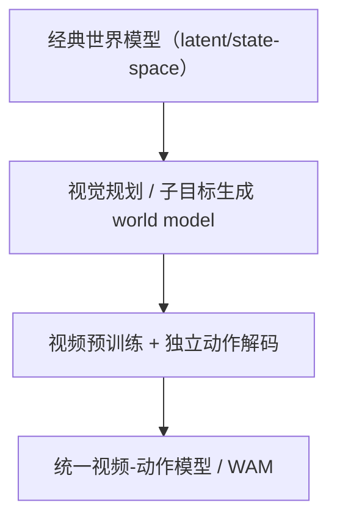

# WAM / World Action Model 路线

## 原文

WAM / World Action Model 路线

第一派：经典世界模型（latent/state-space）  
 这类方法的核心不是先做视频生成，而是先学一个潜在动力学模型，再在想象空间里做策略优化。它们更像model-based RL for robots，代表是 DayDreamer。优点是样本效率高、闭环清晰；短板是世界表征通常比较抽象，开放世界泛化和高保真视觉想象弱。

第二派：视觉规划 / 子目标生成 world model  
 这类方法把生成模型当成高层规划器：先想象未来图像/视频，再交给低层控制器去执行。它们未必直接输出低层动作，而是输出子目标、视频计划或中间视觉状态。UniPi、VLP、SuSIE 都属于这一路。

第三派：视频预训练 + 独立动作解码  
 这是从会想象世界走向能控制机器人的关键桥梁。做法通常是：先让视频模型学到物理与时序先验，再用 inverse dynamics / latent action / action decoder 把视频表征翻译成机器人动作。LAPA、VPP、Vidar、mimic-video 都属于这一类。它们的共同目标是：尽量把昂贵的机器人动作学习，缩减为一个更简单的动作翻译问题。

第四派：统一视频-动作模型 / WAM  
 这类方法不再把世界模型和动作模型彻底拆开，而是试图在一个模型里同时做视频预测、动作生成、正向/逆向动力学甚至 value 预测。PAD、UVA、UWM、WorldVLA、VideoVLA、Motus、Cosmos Policy、DreamZero 都在这条线上，只是统一程度不同。WAM 可以看成这里面最强耦合的版本。

## 按时间线梳理

### 2022：DayDreamer

要解决的问题：真实机器人 RL 试错太贵，sim-to-real 又有 gap。  
核心 insight：先学世界模型，再在 imagination 里优化行为，直接在真机上做在线学习。  
为什么重要：它不是视频 foundation model 路线，但它是机器人世界模型主线里很硬的起点，证明了learn a world model, then imagine futures在真实机器人上是可行的。

### 2023：UniPi

要解决的问题：能不能把策略学习本身改写成更通用的视频生成问题。  
核心 insight：把 sequential decision making 改写成text-conditioned video generation，先合成未来视频，再从视频里抽动作。  
为什么重要：这基本是后面视频先预训练、动作后解码路线的开山思路之一。

### 2023：Video Language Planning（VLP）

要解决的问题：长时程任务很难靠一步到位的 policy 直接做对。  
核心 insight：把视频模型当 dynamics model，把 VLM 当 policy/value，用 tree search 在视频计划空间里做长时程规划。  
为什么重要：它把世界模型的作用明确拉到planning，而不只是 policy learning。

### 2023：SuSIE

要解决的问题：机器人数据里没有的新物体、新场景怎么处理。  
核心 insight：用预训练图像编辑 diffusion 模型生成中间子目标图像，再由低层 goal-conditioned controller 去执行。  
为什么重要：它说明世界模型/生成模型 + 低层控制器的分层范式，在零样本泛化上可以比纯语言条件 policy 更稳。

### 2024：3D-VLA

要解决的问题：很多早期方法仍然是 2D 输入、直接 perception-to-action，缺少 3D 与 dynamics。  
核心 insight：把 3D perception、reasoning、action 和 generative world model 连起来。  
为什么重要：它是一个比较早把生成式世界模型明确塞进 VLA/具身模型里的工作，也提醒大家 2D-only 不是终局。

### 2024：AVID

要解决的问题：最强的视频模型往往是闭源的，而且本身不带 action conditioning。  
核心 insight：不改预训练大模型本体，而是在外面加 adapter/mask，把现成 video diffusion model 适配成action-conditioned world model。  
为什么重要：它代表了一条很实用的路：先复用现成大视频模型，再把动作条件接进去。

### 2024：LAPA

要解决的问题：互联网视频没有机器人动作标签，怎么拿来预训练。  
核心 insight：先从视频帧间学出latent actions，再用这些 latent actions 去预训练 action/VLA 模型，最后再少量机器人数据对齐到真实动作空间。  
为什么重要：它真正打开了无动作标签视频也能喂机器人模型这件事。

### 2024：PAD

要解决的问题：图像未来预测和动作生成一直是两条线，各练各的。  
核心 insight：图像 prediction 和 action diffusion 本质上共享去噪动力学，所以可以用一个 joint denoising process 同时学未来图像和动作。  
为什么重要：这可以看作统一视频-动作模型的早期清晰版本之一。

### 2024/2025：VPP

要解决的问题：传统视觉编码器更会看静态信息，不够会看未来动态。  
核心 insight：视频扩散模型内部的表征天然带有未来动态信息，可以直接拿来给 inverse dynamics/action policy 做条件。  
为什么重要：它把视频质量好  策略更强这个观点讲得非常明确，是视频预训练派里很有代表性的桥梁工作。

### 2025：UVA

要解决的问题：统一模型常常推理太慢，动作精度还不如直接 policy。  
核心 insight：学一个joint video-action latent，但在解码时把 video 和 action 分开；推理动作时可以跳过视频生成头。  
为什么重要：它说明统一模型不一定非要牺牲部署速度，开始往统一但务实走。

### 2025：UWM

要解决的问题：机器人 imitation learning 受限于高质量 expert action 数据，而视频数据没有 action label。  
核心 insight：给 video diffusion 和 action diffusion 设独立 diffusion timestep，一个模型就能在不同模式间切换成 policy、forward dynamics、inverse dynamics、video generator，还能自然吸收无动作视频。  
为什么重要：这是世界模型主线和动作模型主线被真正优雅耦合起来的标志性工作。

### 2025：WorldVLA

要解决的问题：单独 action model 和单独 world model 彼此割裂，而且 autoregressive action 容易误差累积。  
核心 insight：把 VLA 和 world model 放进同一个自回归框架里，并用 action attention masking 缓解 action sequence error accumulation。  
为什么重要：它代表统一 action + world generation从 diffusion 系走向 autoregressive 系。

### 2025：Vidar

要解决的问题：双臂操作数据太稀缺，而且不同平台之间 embodiment gap 很大。  
核心 insight：先学一个embodied video diffusion prior，再用 masked inverse dynamics model 只抓取 action-relevant 的视觉信息。  
为什么重要：它把视频预训练 + IDM 这套思路，推到了generalist bimanual manipulation。

### 2025：mimic-video

要解决的问题：VLA 的预训练大多来自静态图文，物理动态知识只能靠昂贵机器人数据补。  
核心 insight：把互联网级视频模型和 flow-based action decoder 配起来，通过partial denoising 的 latent visual plan + IDM 做控制，并明确提出 Video-Action Models (VAMs) 这个类名。  
为什么重要：它把这条路线的论点说得很清楚：控制问题在很大程度上可以降解成视觉预测问题。

### 2025：VideoVLA

要解决的问题：传统 VLA 的泛化仍然受限，尤其对新任务/新物体/新设置。  
核心 insight：直接把大型视频生成模型改造成机器人 VLA，同时预测动作和未来视觉结果。  
为什么重要：它把video generator can be a manipulator这个观点推得很直。

### 2025：Motus

要解决的问题：理解、世界建模、控制三套模型割裂，无法高效吃异构大数据。  
核心 insight：用 Mixture-of-Transformer 把 understanding expert、video generation expert、action expert 统一起来，并用 optical flow 学 latent actions。  
为什么重要：它代表统一多功能模型派的激进版本。

### 2026：Cosmos Policy

要解决的问题：很多视频模型改策略的方法流程太复杂，还要另加 action head。  
核心 insight：几乎不改大视频模型结构，直接把动作、未来状态、value 都编码成 latent frames，单阶段 post-training 后就能做控制，还能在测试时做 trajectory planning。  
为什么重要：这是把视频 foundation model 直接当 policy/world/value backbone做得最工程化的一类工作。

### 2026：DreamZero（WAM）

要解决的问题：VLA 语义泛化强，但对新物理运动和新环境的泛化不够；而且大家质疑 WAM 是否能实时闭环。  
核心 insight：明确提出 World Action Model，用预训练视频扩散骨干联合预测 future world states 和 actions，并通过系统优化把 14B 模型推到 7Hz 闭环。  
为什么重要：它把 WAM 这个概念真正打响了，也把视频世界模型不是只能看、还能直接做 policy这件事推到最前台。

## 我对这条路线的整体判断

如果你把这两条合起来看，我会给一个很明确的结论：  
主线并不是世界模型和WAM在打架，而是世界模型越来越动作化，动作模型越来越需要世界模型。 早期工作更多是先想象，再交给控制器；中期工作是视频先预训练，动作后解码；最新一波则是视频、动作、value、planning 一起学。这也和近期两个综述对机器人 world model / video model 的归纳一致：研究正在从单一功能模块，往统一但可部署的模型演化。

我自己的排序是：

最基础的底座：DayDreamer 这一类经典世界模型  
 它证明想象式学习在机器人上成立。

真正打开规模化新数据源的关键拐点：LAPA、AVID、VPP  
 因为它们回答了没有机器人动作标签的视频怎么用现成大视频模型怎么改视频表征为什么对动作有用。

把路线推向下一阶段的关键拐点：UWM、WorldVLA、Cosmos Policy、DreamZero  
 因为它们不再把视频和动作完全拆开，而是在朝统一世界-动作建模走。DreamZero 则是这条线里最明确、最有旗帜性的 WAM 表达。

一句话压缩：  
世界模型 / 视频预训练路线解决的是机器人怎么学会想象世界；WAM 解决的是机器人怎么一边想象世界，一边直接给出动作。

## References list

下面这个列表我按从基础到前沿的顺序排，方便你之后读：

[R1] DayDreamer: World Models for Physical Robot Learning  
[R2] Learning Universal Policies via Text-Guided Video Generation (UniPi)  
[R3] Video Language Planning (VLP)  
[R4] Zero-Shot Robotic Manipulation with Pretrained Image-Editing Diffusion Models (SuSIE)  
[R5] 3D-VLA: A 3D Vision-Language-Action Generative World Model  
[R6] AVID: Adapting Video Diffusion Models to World Models  
[R7] Latent Action Pretraining from Videos (LAPA)  
[R8] Prediction with Action: Visual Policy Learning via Joint Denoising Process (PAD)  
[R9] Video Prediction Policy (VPP)  
[R10] Unified Video Action Model (UVA)  
[R11] Unified World Models (UWM)  
[R12] WorldVLA: Towards Autoregressive Action World Model  
[R13] Vidar: Embodied Video Diffusion Model for Generalist Manipulation  
[R14] mimic-video: Video-Action Models for Generalizable Robot Control Beyond VLAs  
[R15] VideoVLA: Video Generators Can Be Generalizable Robot Manipulators  
[R16] Motus: A Unified Latent Action World Model  
[R17] Cosmos Policy: Fine-Tuning Video Models for Visuomotor Control and Planning  
[R18] World Action Models are Zero-shot Policies (DreamZero)  
[R19] Video Generation Models in Robotics: Applications, Research Challenges, Future Directions  
[R20] A Step Toward World Models: A Survey on Robotic Manipulation
